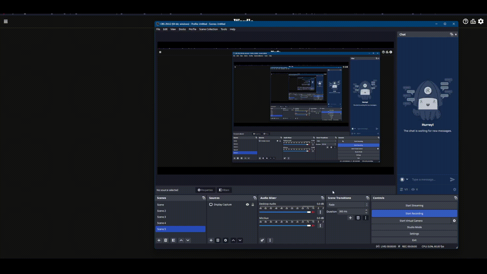

<!-- Improved compatibility of back to top link: See: https://github.com/othneildrew/Best-README-Template/pull/73 -->
<a name="readme-top"></a>
<!--
*** Thanks for checking out the Best-README-Template. If you have a suggestion
*** that would make this better, please fork the repo and create a pull request
*** or simply open an issue with the tag "enhancement".
*** Don't forget to give the project a star!
*** Thanks again! Now go create something AMAZING! :D
-->


<!-- PROJECT SHIELDS -->
<!--
*** I'm using markdown "reference style" links for readability.
*** Reference links are enclosed in brackets [ ] instead of parentheses ( ).
*** See the bottom of this document for the declaration of the reference variables
*** for contributors-url, forks-url, etc. This is an optional, concise syntax you may use.
*** https://www.markdownguide.org/basic-syntax/#reference-style-links
-->
[![Contributors][contributors-shield]][contributors-url]
[![Forks][forks-shield]][forks-url]
[![Stargazers][stars-shield]][stars-url]
[![Issues][issues-shield]][issues-url]
[![MIT License][license-shield]][license-url]


<!-- PROJECT LOGO -->
<br />
<div align="center">
  <a href="https://github.com/kaithub/WordleHax-plus">
    
  </a>

<h3 align="center">WordleHax+</h3>

  <p align="center">
    Making Wordle modding easier than before.
    <br />
    <a href="https://kaithub.github.io/WordleHax-plus/"><strong>Explore the docs »</strong></a>
    <br />
    <br />
    <a href="https://github.com/kaithub/WordleHax-plus">View Demo</a>
    ·
    <a href="https://github.com/kaithub/WordleHax-plus/issues">Report Bug</a>
    ·
    <a href="https://github.com/kaithub/WordleHax-plus/issues">Request Feature</a>
  </p>
</div>


<!-- TABLE OF CONTENTS -->
<details>
  <summary>Table of Contents</summary>
  <ol>
    <li>
      <a href="#about-the-project">About The Project</a>
    </li>
    <li>
      <a href="#getting-started">Getting Started</a>
      <ul>
        <li><a href="#prerequisites">Prerequisites</a></li>
        <li><a href="#installation">Installation</a></li>
      </ul>
    </li>
    <li><a href="#usage">Usage</a></li>
    <li><a href="#roadmap">Roadmap</a></li>
    <li><a href="#contributing">Contributing</a></li>
    <li><a href="#license">License</a></li>
    <li><a href="#contact">Contact</a></li>
    <li><a href="#acknowledgments">Acknowledgments</a></li>
  </ol>
</details>


<!-- ABOUT THE PROJECT -->
## About The Project

Here's a blank template to get started: To avoid retyping too much info. Do a search and replace with your text editor for the following: `kaithub`, `Kai/S` `WordleHax-plus`, `WordleHax+`, `Making Wordle modding easier than before.`

<p align="right">(<a href="#readme-top">back to top</a>)</p>

<!-- GETTING STARTED -->
## Getting Started

This is an example of how you may give instructions on setting up your project locally.
To get a local copy up and running follow these simple example steps.

### Install(Not self-built)

Please refer to the [Documentation](https://kaithub.github.io/WordleHax-plus/).

### Prerequisites

This is an example of how to list things you need to use the software and how to install them.
* npm
  ```sh
  npm install npm@latest -g
  ```

### Installation

1. Clone the repo
   ```sh
   git clone https://github.com/kaithub/WordleHax-plus.git
   ```
2. Install NPM packages
   ```sh
   npm install
   ```
3. Build WordleHax+
   ```sh
   npm run build
   ```
4. Create a bookmark in your browser

<p align="right">(<a href="#readme-top">back to top</a>)</p>


<!-- USAGE EXAMPLES -->
## Usage

Once WordleHax+ is installed, your theme & it's source is packed into one. Navigate to Wordle (on NYT), press the bookmark, and watch the magic unfold.


_For more examples, please refer to the [Documentation](https://kaithub.github.io/WordleHax-plus/)_

<p align="right">(<a href="#readme-top">back to top</a>)</p>


<!-- ROADMAP -->
## Roadmap

- [x] Stable injection method
- [x] Restart Wordle
- [ ] Get Answer (I found the endpoint where the answers are stored)
    - [ ] Get Hints

See the [open issues](https://github.com/kaithub/WordleHax-plus/issues) for a full list of proposed features (and known issues).

<p align="right">(<a href="#readme-top">back to top</a>)</p>


<!-- CONTRIBUTING -->
## Contributing

Contributions are what make the open source community such an amazing place to learn, inspire, and create. Any contributions you make are **greatly appreciated**.

If you have a suggestion that would make this better, please fork the repo and create a pull request. You can also simply open an issue with the tag "enhancement".
Don't forget to give the project a star! Thanks again!

1. Fork the Project
2. Create your Feature Branch (`git checkout -b feature/AmazingFeature`)
3. Commit your Changes (`git commit -m 'Add some AmazingFeature'`)
4. Push to the Branch (`git push origin feature/AmazingFeature`)
5. Open a Pull Request

<p align="right">(<a href="#readme-top">back to top</a>)</p>


<!-- LICENSE -->
## License

Distributed under the MIT License. See `LICENSE.txt` for more information.

<p align="right">(<a href="#readme-top">back to top</a>)</p>


<!-- CONTACT -->
## Contact

Yea ok, ur not getting this info..

Project Link: [https://github.com/kaithub/WordleHax-plus](https://github.com/kaithub/WordleHax-plus)

<p align="right">(<a href="#readme-top">back to top</a>)</p>


<!-- ACKNOWLEDGMENTS -->
## Acknowledgments

* []()
* []()
* []()

<p align="right">(<a href="#readme-top">back to top</a>)</p>


<!-- MARKDOWN LINKS & IMAGES -->
<!-- https://www.markdownguide.org/basic-syntax/#reference-style-links -->
[contributors-shield]: https://img.shields.io/github/contributors/kaithub/WordleHax-plus.svg?style=for-the-badge
[contributors-url]: https://github.com/kaithub/WordleHax-plus/graphs/contributors
[forks-shield]: https://img.shields.io/github/forks/kaithub/WordleHax-plus.svg?style=for-the-badge
[forks-url]: https://github.com/kaithub/WordleHax-plus/network/members
[stars-shield]: https://img.shields.io/github/stars/kaithub/WordleHax-plus.svg?style=for-the-badge
[stars-url]: https://github.com/kaithub/WordleHax-plus/stargazers
[issues-shield]: https://img.shields.io/github/issues/kaithub/WordleHax-plus.svg?style=for-the-badge
[issues-url]: https://github.com/kaithub/WordleHax-plus/issues
[license-shield]: https://img.shields.io/github/license/kaithub/WordleHax-plus.svg?style=for-the-badge
[license-url]: https://github.com/kaithub/WordleHax-plus/blob/master/LICENSE.txt
[product-screenshot]: images/screenshot.png